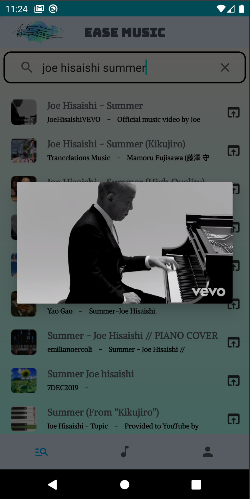

### Description:
Ease Music is an Android music application with sound visualization and beat vibration. Provides convenient search and cache services for music resources.

### Demo:

### Design:

### Software Usages:
Android:
- Matieral Design
- OkHttp
- Picasso
- Media Player
- SQLite
- YouTube Player

Backend:
- Spring Boot
- YouTube Data API
- yt-dlp
- gRPC
- MySQL
- Docker

### Build and start
- Android: [apk](./apk/ease_music.apk)
- Web server: [jar](./server/webServer/build/web-server.jar)
- File server: [makefile](./server/fileServer/Makefile)

### API Reference:

- https://developers.google.com/youtube/v3/docs/search/list
- https://github.com/yt-dlp/yt-dlp
- https://github.com/kkroening/ffmpeg-python
- https://github.com/PierfrancescoSoffritti/android-youtube-player

### Image resource:

- <a href="https://www.freepik.com/free-vector/musical-melody-symbols-bright-blue-splotch_19376830.htm#query=music&position=4&from_view=keyword&track=sph">Image by brgfx</a> on Freepik
